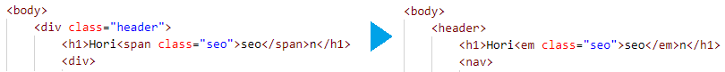
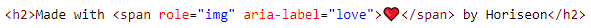

# Accessibility Code Refactor

This is a model of a website refactorization for optimizing accessibility. Accessibility is a vital aspect for consideration when designing web interfaces whether for public or simply commercial use. There is a wide range of possible disabilities to consider, so this project was primarily focused on code refactoring for use of semantic HTML elements, descriptive input for screen readers, and organization of flow.

### HTML Refactorization

`
` tags are very useful for formatting via CSS, however they do not offer context and thus interact poorly with accessibility software. This can be avoided by replacing these tags with semantic HTML elements such as `<nav>` and `<section>`, without changing the webpage's appearance when deployed.

### Alt Text & ARIA Attributes

For the vision-impaired, alt text is important for screen reading software to convey the image content of a page. For other elements, ARIA attributes provide a similar function.

---

## Getting Started

These instructions will get you a copy of the project up and running on your local machine for development and testing purposes. See deployment for notes on how to deploy the project on a live system.

### Prerequisites

* IDE to view/edit source code (e.g. Visual Studio Code).

### Installing

1. Clone repository.
1. Open [index.html](index.html) in web browser.

### Deployment

1. Upload index.html and assets folder to webhosting site, such as GitHub.
1. If using GitHub, deploy via GitHub Pages.

---

## Built With

* [HTML](https://developer.mozilla.org/en-US/docs/Web/HTML)
* [CSS](https://developer.mozilla.org/en-US/docs/Web/CSS)
* [GitHub](https://github.com/)

## Deployed Page

* [See Live Site](https://starryblue7.github.io/accessibility-code-refactor/)

## Author

Vince Lee
- [Portfolio](https://starryblue7.github.io/)
- [Github](https://github.com/StarryBlue7)
- [LinkedIn](https://www.linkedin.com/in/vince-lee/)

## License

License: [MIT License](https://vince-lee.mit-license.org/)

## Acknowledgments

* Adapted from webpage provided by [UC Berkeley Coding Bootcamp](https://bootcamp.berkeley.edu/coding/).
* Image and emoji captioning for screen readers inspired by Rachel Leggett's article ["How to Make Emojis Accessible in HTML"](https://dev.to/rleggos/how-to-make-emojis-accessible-in-html-2n71).
* Accessibility assessed via automated software from [Lighthouse Chrome Extension](https://chrome.google.com/webstore/detail/lighthouse/blipmdconlkpinefehnmjammfjpmpbjk).
